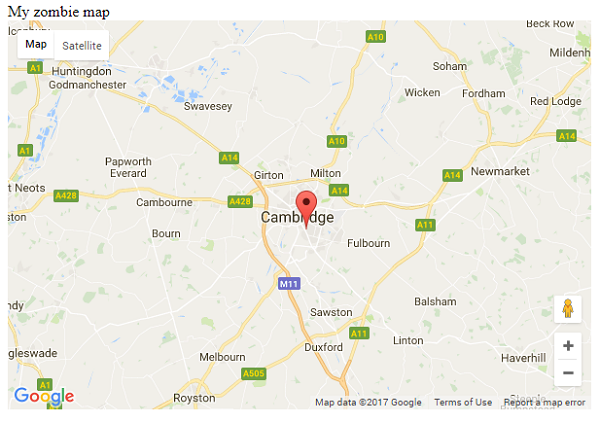

## Place a marker

+ Add a marker to your map at the same latitude and longitude we used before when we created the map.

[[[generic-api-google-maps-marker]]]

--- hints ---
--- hint ---
Put the marker code on a blank line before the ending `}` of the `initMap()` function.
--- /hint ---

--- hint ---
You will need to make sure that the marker has the correct map set. The map in the example is called `mymap` - what is the map called which we have created?
--- /hint ---

--- /hints ---



At the moment our marker just appears at a fixed location. To make it easier to construct the map, let's add some code to create a marker at a position we click on the map.

+ Remove your marker code and put it inside a function called `place_marker()`.

[[[generic-javascript-create-a-function]]]

--- hints ---
--- hint ---
Your function should begin after the end of the `initMap()` function. Look for the closing `}` and begin writing the function code on a blank line below that.
--- /hint ---

--- hint ---
The function in the example is called `name_of_function`. Can you change it to be called `place_marker`?
--- /hint ---

--- hint ---
Put your marker code between the braces `{` and `}`.
```javascript
function place_marker(){

}
```
--- /hint ---

--- /hints ---

+ Now we will add some code to "listen" for clicks on the map. When a click is detected, we will call the function we just created to place a marker at the location of the click. Locate the `initMap()` function and add the following code inside it, meaning after the other code in the function but before the closing `}`.

```javascript
zombie_map.addListener('click', function(e) {
  place_marker();
});
```

+ Save your code and click on the map to test whether a red marker appears.

--- collapse ---
---
title: What happens?
---

A marker will appear on the map, but no matter where you click the marker will always be in the same place.

--- /collapse ---

--- collapse ---
---
title: Why does this happen?
---

Inside the `place_marker()` function, we specify the longitude and latitude of the marker, so it is the same every time. We need to be able to pass the longitude and latitude values of where we clicked on the map into the function so that we can place the marker at the position that was clicked, rather than a specific position.

--- /collapse ---
