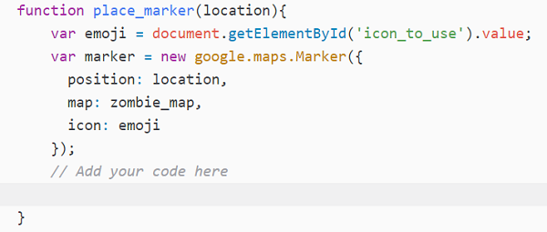

## Log your locations

Once you've created your map with the nifty map creator you just build, you want to be able to keep it and use it in the event of a zombie apocalypse. We need to be able to log the locations you chose and what was at each location, and for this we'll use the JavaScript console log.

+ Open the JavaScript console in your web browser

[[[generic-javascript-opening-console]]]

The JavaScript console is actually used for debugging your programs. If they aren't working, you can check the console to see any error messages that might come up. You can also log to the console yourself if you want to see the value of a variable at a particular point in your program, or check whether your program is running a particular piece of code.

We're going to use the console log to keep track of the latitude and longitude of each point, and what was at the point - zombie, hospital or weapons.

+ We need to add some code so that when we place a marker, we also log its location and type to the console. We will add this code inside the `place_marker()` function.



+ Here is some code to log a message to the console:

```JavaScript
console.log("You clicked the map");
```

Add this code, save the file and then check that each time you click on the map, you see the message `You clicked the map` appear in the console.

+ Finally, let's log the data we actually want. Remove the sentence `You clicked the map` and replace it with code to log the latitude, longitude and the type of emoji we used, so that it looks like this:


--- hints ---
--- hint ---
You can get the latitude value within the `place_marker()` function as `location.lat()` and the longitude value as `location.lng()`
--- /hint ---

--- hint ---
You will need to **concatenate** the values together by using the `+` to join them. For example if I wanted to concatenate the strings `"Hello"` and `"world"` I would write `"Hello" + "world"`.
--- /hint ---

--- hint ---
To add a space between the values you will also need to concatenate in a string containing a space - `" "` 
--- /hint ---

--- /hints ---
