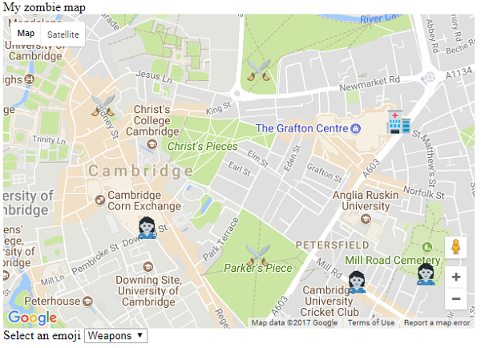

## Introducción

¡Crea un mapa real de tu área local y marca en él la ubicación de los suministros, las bases secretas e incluso los propios zombis!

### ¿Qué vas a hacer?

Aquí hay un ejemplo de un mapa de supervivencia de zombis de Cambridge, Reino Unido.

### Lo que vas a aprender

Aprenderás a mostrar un mapa de Google en una página web y a agregar un icono específico al mapa cuando haga clic en una ubicación.

Este proyecto cubre elementos de los siguientes capítulos del [Raspberry Pi Digital Making Curriculum](http://rpf.io/curriculum):

+ [Combine programming constructs to solve a problem](https://curriculum.raspberrypi.org/programming/builder/)
+ [Design basic 2D and 3D assets](https://curriculum.raspberrypi.org/design/creator/)
